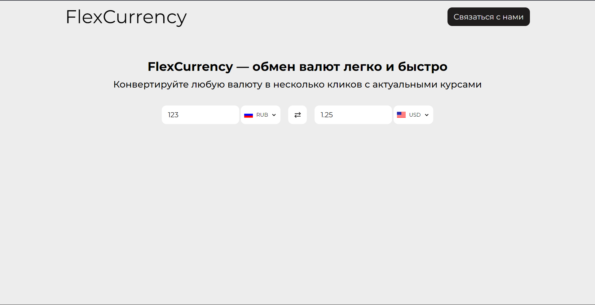

# FlexCurrency

FlexCurrency — это простой и удобный конвертер валют, который позволяет пользователям мгновенно пересчитывать суммы из одной валюты в другую с использованием актуальных курсов обмена. Этот проект демонстрирует базовые навыки работы с API, fetch-запросами, манипуляцией с DOM и обработкой ошибок.

##Скриншот

## Функционал

- Выбор исходной и целевой валют.
- Автоматическое обновление сконвертированной суммы при вводе значений.
- Возможность переключения валют местами.
- Динамическое обновление флагов валют.

## Технологии

- HTML
- CSS
- JavaScript

## Источник данных

Курсы валют берутся с API ExchangeRate-API.

## Дизайн вдохновлен

Дизайн приложения вдохновлен проектом [Currency Converter App](https://www.behance.net/gallery/105768539/Currency-Converter-App/modules/607027491) на Behance.

